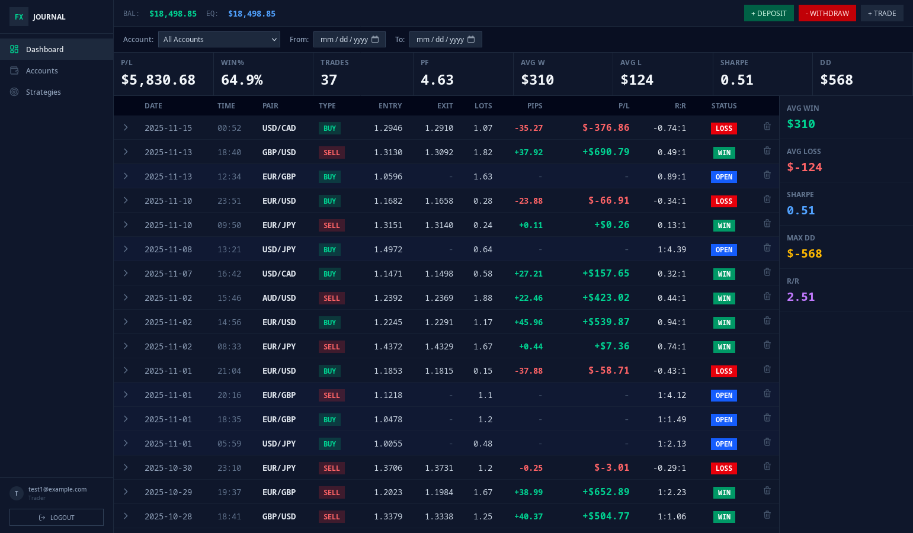

# Trade Journal

A forex trading journal application with a SvelteKit frontend and Go backend.



## Features
- 📊 Real-time trading analytics and metrics
- 💰 Account balance tracking with deposits/withdrawals
- 📈 Trade management with P/L calculations
- 🎯 Strategy tracking and assignment
- 🌙 Dark terminal-inspired UI
- 🔐 JWT authentication

## Project Structure (DDD Architecture)

```
.
├── web/                                    # SvelteKit frontend
├── cmd/api/                               # Application entry point
├── internal/
│   ├── domain/                            # Domain layer (business logic)
│   │   └── user/                          # User domain
│   │       ├── entity.go                  # User entity
│   │       └── repository.go              # Repository interface
│   ├── application/                       # Application layer (use cases)
│   │   └── auth/                          # Authentication use cases
│   │       ├── dto.go                     # Data transfer objects
│   │       └── service.go                 # Authentication service
│   ├── infrastructure/                    # Infrastructure layer
│   │   ├── persistence/                   # Database implementations
│   │   │   └── user_repository.go         # User repository implementation
│   │   ├── security/                      # Security implementations
│   │   │   └── jwt.go                     # JWT token generator
│   │   └── http/                          # HTTP layer
│   │       ├── handlers/                  # HTTP handlers
│   │       │   └── auth_handler.go
│   │       └── middleware/                # HTTP middleware
│   │           └── auth.go
│   └── db/                                # Generated sqlc code
├── db/
│   ├── migrations/                        # Database migrations (dbmate)
│   └── queries/                           # SQL queries (sqlc)
└── .env                                   # Environment variables
```

## Architecture

This project follows **Domain-Driven Design (DDD)** principles:

- **Domain Layer**: Contains business entities and repository interfaces (independent of frameworks)
- **Application Layer**: Contains use cases and business logic orchestration
- **Infrastructure Layer**: Contains concrete implementations (database, HTTP, security)
- **Presentation Layer**: HTTP handlers that translate between HTTP and application layer

## Prerequisites

- Go 1.24+
- Node.js 18+
- PostgreSQL
- dbmate (database migrations): `brew install dbmate` or see [dbmate docs](https://github.com/amacneil/dbmate)
- sqlc (SQL code generation): `brew install sqlc` or see [sqlc docs](https://docs.sqlc.dev/en/latest/overview/install.html)

## Backend Setup

### 1. Environment Variables

Copy `.env.example` to `.env` and update the values:

```bash
cp .env.example .env
```

### 2. Database Setup

**Option A: Using Docker (Recommended for Development)**

Start PostgreSQL using Docker Compose:

```bash
make docker-up
```

Run migrations:

```bash
make migrate-up
```

Stop the database when done:

```bash
make docker-down
```

View logs:

```bash
make docker-logs
```

**Option B: Using Local PostgreSQL**

Create the PostgreSQL database:

```bash
createdb trade_journal
```

Run migrations:

```bash
make migrate-up
```

### 3. Run the Backend

```bash
make run
```

The API will be available at `http://localhost:8080`

## Frontend Setup

### 1. Environment Variables

```bash
cd web
cp .env.example .env
```

### 2. Install Dependencies and Run

```bash
npm install
npm run dev
```

The frontend will be available at `http://localhost:5173`

## Quick Start

### Option 1: Docker (Recommended for Production/Easy Setup)

Deploy the entire stack with one command:

```bash
./deploy.sh
```

Or manually:

```bash
docker-compose up -d
```

Access the application:
- Frontend: `http://localhost:3000`
- Backend API: `http://localhost:8080`
- MinIO Console: `http://localhost:9001`

See [DOCKER.md](./DOCKER.md) for detailed Docker deployment instructions.

### Option 2: Local Development

**Terminal 1 - Database:**
```bash
make docker-up
make migrate-up
```

**Terminal 2 - Backend:**
```bash
make run
```

**Terminal 3 - Frontend:**
```bash
cd web
npm run dev
```

Then visit:
- Frontend: `http://localhost:5173`
- Backend API: `http://localhost:8080`

## Tech Stack

### Backend
- Echo v4 (Web framework)
- sqlc (Type-safe SQL)
- dbmate (Database migrations)
- PostgreSQL (Database)
- JWT (Authentication)

### Frontend
- SvelteKit
- TailwindCSS
- TypeScript
